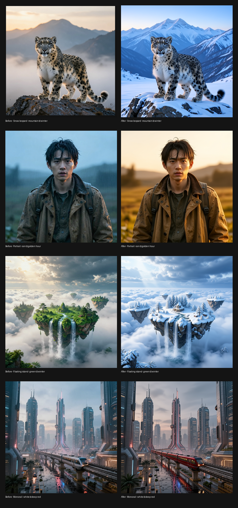

# Mage-Flow-Edit-Turbo trên TPU v5e-8

> 🌐 Ngôn ngữ: [English](README.md) · **Tiếng Việt**

[](https://github.com/dangkhoa2016/Mage-Flow-Edit-Turbo-On-TPU-v5e8/actions/workflows/ci.yml)
[](https://github.com/dangkhoa2016/Mage-Flow-Edit-Turbo-On-TPU-v5e8/releases/tag/v1.0.0)
[](LICENSE)


Một **runtime inference JAX/Keras 3 dạng source-only cùng bộ qualification cho Mage-Flow-Edit-Turbo trên Kaggle TPU v5e-8**. Repository này ghi lại phần engineering cần thiết để pipeline edit có thể chạy được, tái lập được, review được và publish được trên TPU: Qwen3-VL multimodal conditioning, reference-image VAE encoding, Edit transformer execution, deterministic RoPE support, TPU sharding, staged orchestration, CPU regression tests, machine-readable acceptance evidence và standalone JAX/Orbax model artifact.

Artifact Edit-Turbo công khai là **standalone cho pipeline này**. Nó cung cấp text encoder, Edit transformer, VAE, manifest, RoPE capture và model-side metadata mà runner cần; **không cần** một model Turbo-JAX riêng.

**Các public surface:** [Hugging Face model](https://huggingface.co/dangkhoa2016/mage-flow-edit-turbo-jax-tpu-v5e8) · [Kaggle model](https://www.kaggle.com/models/dangkhoa2016/mage-flow-edit-turbo-jax-tpu-v5e8) · [Kaggle Public Acceptance notebook](https://www.kaggle.com/code/dangkhoa2016/mage-flow-edit-turbo-tpu-v5e8-public-acceptance) · [GitHub v1.0.0](https://github.com/dangkhoa2016/Mage-Flow-Edit-Turbo-On-TPU-v5e8/releases/tag/v1.0.0)

## Preview showcase TPU đã duyệt



*Contact sheet before/after đã duyệt của v1.0.0, lấy trực tiếp từ canonical release bundle. Cả bốn public edit được chọn đều dùng đường 768×768 / q256 đã validation; ảnh được đặt ngay trong README để người review có thể xem showcase mà không cần rời GitHub.*

## v1.0.0 chứng minh điều gì

Release này không chỉ là một snapshot chuyển đổi model. Đây là một TPU execution path có evidence và ranh giới qualification được ghi rõ:

- **512×512 / q256 / 4 steps — production-qualified baseline.** Ba edit scenario đã PASS end-to-end; mỗi case chạy seed 42–45 và tạo bốn PNG có SHA-256 khác nhau.
- **768×768 / q256 — validated scaling.** Một fresh four-seed repeat đã tái lập bit-for-bit toàn bộ 4 PNG hash.
- **1024×1024 / q128 — experimental high resolution.** Nhiều subject chạy thành công; dedicated q128 repeat deterministic trong chính cấu hình q128 đã test.
- **q128 không output-neutral so với q256.** Ở 512px, q128 và q256 không bit-identical, vì vậy chúng được ghi nhận là các execution configuration được qualification riêng.
- **Source repository vẫn nhẹ.** Model/checkpoint blob được chủ động giữ ngoài Git trong khi public JAX/Orbax artifact vẫn có thể mount trực tiếp cho runner.

## Phạm vi engineering

Repository bao phủ toàn bộ đường edit inference thay vì chỉ bọc một TPU command có sẵn:

1. **Qwen3-VL text conditioning** — restore và bind converted BF16 text encoder, triển khai text forward path, RMSNorm, attention, GQA repeat-KV, MLP và multimodal rotary behavior bằng JAX.
2. **Qwen3-VL vision conditioning** — xử lý ảnh tham chiếu và cung cấp visual/deep-stack features cần cho edit conditioning.
3. **Reference-image VAE path** — encode ảnh nguồn sang latent và decode target latent cuối cùng về RGB.
4. **Mage-Flow Edit transformer** — dựng lại transformer execution path, bind converted checkpoint 397 leaf và pack đúng target/reference edit sequence.
5. **Deterministic RoPE** — sử dụng captured basis array và runtime provider tường minh thay vì phụ thuộc vào một hidden dependency không có sẵn.
6. **TPU partitioning và orchestration** — chạy topology Kaggle TPU v5e-8 đã qualification theo `4x2`, với transformer plan ghi nhận **174 sharded + 223 replicated = 397 leaf**.
7. **Verification và evidence** — CPU regression tests, repository-health checks, production acceptance JSON, extended TPU validation và exact showcase hashes.

Các converted checkpoint contract được runtime biểu diễn gồm **Edit transformer 397 leaf**, restore path cho **BF16 text encoder 713 leaf** và **VAE 839 leaf**. Đây là số lượng leaf của converted runtime state tree trong dự án, **không phải** số lượng tham số của model.

## Kiến trúc runtime

```text
Edit instruction + reference image
            │
            ▼
  Qwen3-VL multimodal conditioning
     ├─ text encoder
     └─ vision/deep-stack features
            │
            ├──────────────┐
            ▼              │
   Reference VAE encode    │
            │              │
            └──────┬───────┘
                   ▼
       Edit transformer on TPU
       target + reference tokens
                   │
                   ▼
          target latent update
                   │
                   ▼
             VAE decode
                   │
                   ▼
                PNG output
```

Xem [`docs/ARCHITECTURE.vi.md`](docs/ARCHITECTURE.vi.md) để biết chi tiết runtime decomposition và TPU topology.

## Ma trận qualification

| Cấu hình | Phân loại | Reproducibility evidence | Transformer evidence đại diện |
|---|---|---|---:|
| 512×512 · q256 · 4 steps | **Production-qualified baseline** | 3/3 acceptance case PASS; seed 42–45; 4 PNG unique mỗi case | 50.85–53.78 s trên các case đã accept |
| 768×768 · q256 · 4 steps | **Validated scaling** | fresh four-seed repeat tái lập 4/4 PNG SHA-256 | repeat 66.59 s; showcase khoảng 67 s |
| 1024×1024 · q128 · 4 steps | **Experimental high resolution** | fox q128 repeat tái lập 4/4 hash; floating-island edit PASS | island 133.22 s |

Extended benchmark còn ghi nhận các stage measurement đại diện sau:

| Resolution | Query chunk | Conditioning internal | Transformer compute | Peak HBM/device | VAE cold |
|---:|---:|---:|---:|---:|---:|
| 512 | 256 | 61.10 s | 49.72 s | 10.39 GB | 18.49 s |
| 768 | 256 | 46.31 s | 69.08 s | 13.26 GB | 21.47 s |
| 1024 | 128 | 48.65 s | 129.42 s | 15.93 GB | 20.64 s |

Đây là số đo của các run cụ thể, không phải service-level guarantee. Benchmark authority nằm tại [`release-evidence/BENCHMARKS.vi.md`](release-evidence/BENCHMARKS.vi.md) và [`release-evidence/EXTENDED_VALIDATION.json`](release-evidence/EXTENDED_VALIDATION.json).

## Production acceptance

Frozen baseline 512/q256 đã được accept trên ba edit scenario khác nhau:

| Case | Seed | Conditioning tokens | Transformer wall time | Peak HBM/device | Kết quả |
|---|---|---:|---:|---:|---|
| fox-autumn | 42, 43, 44, 45 | 286 | 50.852 s | 10,385,165,824 byte | PASS · 4/4 PNG hash unique |
| portrait-golden-hour | 42, 43, 44, 45 | 309 | 52.651 s | 10,425,102,848 byte | PASS · 4/4 PNG hash unique |
| island-winter | 42, 43, 44, 45 | 311 | 53.776 s | 10,395,812,864 byte | PASS · 4/4 PNG hash unique |

Machine-readable authority: [`acceptance/PRODUCTION_ACCEPTANCE.json`](acceptance/PRODUCTION_ACCEPTANCE.json). Human-readable closeout: [`acceptance/PRODUCTION_ACCEPTANCE_CLOSEOUT.vi.md`](acceptance/PRODUCTION_ACCEPTANCE_CLOSEOUT.vi.md).

## Determinism: đã chứng minh gì và chưa chứng minh gì

Determinism được phát biểu theo từng cấu hình đã test, không suy rộng toàn cục.

- 512/q256 là frozen production-qualified baseline.
- 768/q256 có fresh repeat tái lập bit-for-bit toàn bộ bốn PNG SHA-256.
- 1024/q128 có deterministic evidence trong setup q128, nhưng vẫn là experimental high resolution.
- 512/q128 và 512/q256 **không bit-identical**. Vì vậy `query_chunk` là một phần của qualification identity và không được mô tả là output-neutral.
- CPU regression tests kiểm tra contract và wiring; chúng **không** thay thế TPU numerical qualification.

Xem [`docs/REPRODUCIBILITY.vi.md`](docs/REPRODUCIBILITY.vi.md) để biết reproducibility contract.

## Public showcase đã duyệt

Showcase v1.0.0 được chọn dùng đường **768/q256** đã validation cho cả bốn public pair:

| Edit | Seed | Transformer evidence | Peak HBM/device |
|---|---:|---:|---:|
| Snow Leopard · mountain → snowy winter | 52 | 67.26 s | 13.47 GB |
| Portrait · rain → golden hour | 43 | validated 768/q256 path | validated 768/q256 path |
| Floating Island · green → winter | 43 | validated 768/q256 path | validated 768/q256 path |
| Monorail · white/silver → deep red | 43 | 67.01 s | 13.46 GB |

Prompt chính xác, selected SHA-256, kích thước before/after và các high-resolution proof 1024/q128 riêng biệt nằm trong [`release-evidence/PUBLISH_MANIFEST.json`](release-evidence/PUBLISH_MANIFEST.json). Proof Floating Island 1024 được chủ động **không** thay thế public pair 768 đã chọn.

## Standalone artifact contract

Trỏ `--artifact-root` tới public Edit-Turbo JAX artifact. Runtime kỳ vọng artifact cung cấp:

```text
artifact-root/
├── text_encoder/
├── checkpoints/
│   ├── text_encoder/
│   ├── transformer/
│   └── vae/
├── manifests/
└── rope/
```

Artifact được publish tách khỏi Git vì repository chủ động không chứa model/checkpoint payload. Xem [`docs/ARTIFACTS.vi.md`](docs/ARTIFACTS.vi.md) về contract và [`docs/KAGGLE.vi.md`](docs/KAGGLE.vi.md) về quy trình mount trên Kaggle.

## One-command TPU edit runner

```bash
python bootstrap/08_run_tpu_edit.py \
  --image /path/reference.png \
  --prompt "Transform the environment while preserving the subject" \
  --output /kaggle/working/edit-output \
  --artifact-root /path/to/mage-flow-edit-turbo-jax-tpu-v5e8 \
  --resolution 512 \
  --seeds 42,43,44,45
```

Production baseline là 512/q256/4 steps. Hãy đọc [`docs/INFERENCE-GUIDE.vi.md`](docs/INFERENCE-GUIDE.vi.md) trước khi thay đổi resolution hoặc query chunk vì các high-resolution configuration có qualification status khác nhau.

## Bản đồ repository

| Path | Mục đích |
|---|---|
| `runtime/experiment/` | text/vision conditioning, RoPE, VAE và transformer runtime driver |
| `runtime/source/mage_flow_keras/` | Mage transformer source đã dựng lại cho converted checkpoint |
| `bootstrap/` | TPU stage entry point và one-command orchestration runner |
| `qwen3vl-processor-assets/` | processor/tokenizer metadata; không có model weights |
| `acceptance/` | production qualification authority và closeout |
| `release-evidence/` | extended validation, benchmark evidence và approved showcase manifest |
| `notebooks/` | Kaggle production notebook |
| `tests/` | CPU regression tests cho runtime và repository contract |
| `scripts/` | acceptance builder và repository-health validation |
| `docs/` | tài liệu song ngữ về architecture, inference, benchmark, reproducibility, artifact, limitation và release |

## Kiểm chứng source repository

```bash
python -m compileall -q runtime bootstrap tests scripts
KERAS_BACKEND=jax USE_TORCH_XLA=0 pytest -q tests
python scripts/check_repo_health.py
git diff --check
```

`check_repo_health.py` còn enforce public-documentation contract, exact MIT author line, source-only/no-weight policy, qualification wording và canonical showcase metadata.

## Thứ tự ưu tiên của evidence

Khi review hoặc tái lập, hãy dùng authority cụ thể thay vì suy luận từ screenshot:

1. [`acceptance/PRODUCTION_ACCEPTANCE.json`](acceptance/PRODUCTION_ACCEPTANCE.json) — frozen production acceptance 512/q256.
2. [`release-evidence/EXTENDED_VALIDATION.json`](release-evidence/EXTENDED_VALIDATION.json) — 768 scaling, 1024/q128 và cross-query-chunk findings.
3. [`release-evidence/PUBLISH_MANIFEST.json`](release-evidence/PUBLISH_MANIFEST.json) — approved public showcase, prompt và exact hash.
4. [`release-evidence/BENCHMARKS.vi.md`](release-evidence/BENCHMARKS.vi.md) — compact benchmark summary.
5. [`docs/RELEASE-EVIDENCE-v1.0.0.vi.md`](docs/RELEASE-EVIDENCE-v1.0.0.vi.md) — release evidence guide.
6. [`notebooks/kaggle-production-demo.ipynb`](notebooks/kaggle-production-demo.ipynb) — source thực thi được giữ lại trong repository; không phải public Kaggle notebook hiện hành.

## Phạm vi và giới hạn

- Production qualification chỉ áp dụng cho **512×512 / q256 / 4 steps** trên topology Kaggle TPU v5e-8 `4x2` đã test.
- 768/q256 là validated scaling, không phải production baseline.
- 1024/q128 là experimental high resolution.
- Timing và HBM là evidence từ các run cụ thể, không phải performance target được đảm bảo.
- CPU test không tự chứng minh TPU numerical equivalence.
- Đây là independent runtime/conversion engineering effort; dự án không retrain Mage-Flow-Edit-Turbo và không relicense upstream weights.

Xem thêm [`docs/LIMITATIONS.vi.md`](docs/LIMITATIONS.vi.md) và [`docs/TROUBLESHOOTING.vi.md`](docs/TROUBLESHOOTING.vi.md).

## Licensing và provenance

Code/tài liệu engineering do repository tự tạo được cấp MIT trong phạm vi tác giả có quyền cấp phép. Upstream model weights/material và third-party component giữ nguyên license/notice tương ứng.

Hãy đọc [`LICENSE`](LICENSE), [`LICENSES.vi.md`](LICENSES.vi.md), [`MODEL_LICENSE.vi.md`](MODEL_LICENSE.vi.md), [`ASSET_LICENSE.vi.md`](ASSET_LICENSE.vi.md), [`THIRD_PARTY_NOTICES.vi.md`](THIRD_PARTY_NOTICES.vi.md), [`NOTICE.vi.md`](NOTICE.vi.md) và [`licenses/`](licenses/) trước khi redistribute model-side artifact hoặc showcase asset.

## Tài liệu release

- [`RELEASE_NOTES_v1.0.0.vi.md`](RELEASE_NOTES_v1.0.0.vi.md) — tổng quan release v1.0.0.
- [`CHANGELOG.vi.md`](CHANGELOG.vi.md) — lịch sử thay đổi của dự án.
- [`CONTRIBUTING.vi.md`](CONTRIBUTING.vi.md) — contribution workflow.
- [`SECURITY.vi.md`](SECURITY.vi.md) — security policy.
- [`SUPPORT.vi.md`](SUPPORT.vi.md) — support boundary.

**v1.0.0 là community-facing release đầu tiên của TPU runtime và evidence package này.** Mục tiêu không chỉ là chứng minh có thể sinh được một ảnh, mà còn làm cho execution path, numerical boundary, artifact và release evidence đủ tường minh để các engineer khác có thể kiểm tra.
